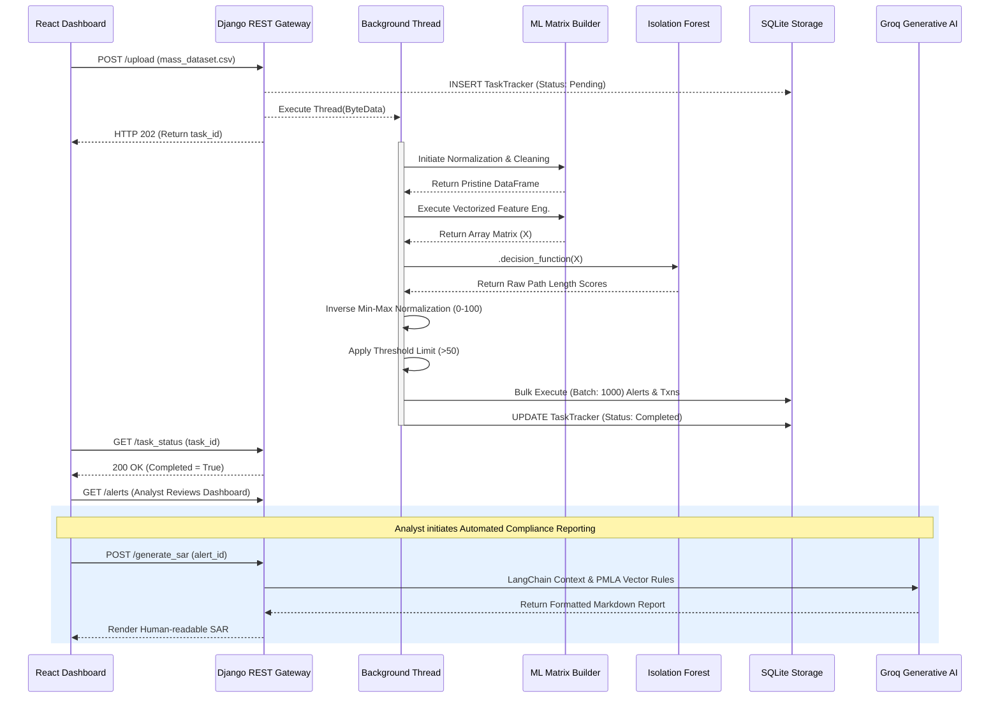

# Chapter 10: End-to-End Execution Flow

The previous chapters detailed the isolated components of our Anti-Money Laundering architecture—from Pandas ingestion to Isolation Forest math and generative AI logic. 

This chapter acts as the master blueprint, tying all disparate modules together into a unified, sequential **Data Science Pipeline**. We trace the absolute path of a dataset from the moment it leaves the compliance officer's computer to the moment a formal Suspicious Activity Report (SAR) is drafted.

## 10.1 Initialization Phase (Data Upload to Task Queue)

Every analytical run strictly begins with the **Initialization Phase**. Because moving millions of bytes of data is computationally expensive, this phase must decouple the web server from the intelligence engine.

1.  **Client Payload:** The Compliance Analyst uses the React Dashboard to authorize the upload of a standard `.csv` or `.xlsx` file containing historical transaction logs.
2.  **Stateless API Reception:** The Django REST Framework `UploadView` receives the binary payload. It deliberately avoids parsing the rows.
3.  **Task Instantiation:** A UUID is generated for the new job, and a `ProcessingTask` tracker is initialized in the database with the state `Pending`.
4.  **Handoff:** The raw byte stream is thrown over the wall to an independent Python daemon thread, freeing the UI to return a success code instantly.

## 10.2 Analysis Phase (Preprocess -> Feature Eng. -> ML Inference)

This is the mathematical core of the engine, executing entirely in RAM.

1.  **Pandas Materialization:** The `risk_engine.py` daemon reconstructs the byte stream into a `pandas.DataFrame`.
2.  **Normalization:** The dictionary-mapping logic forces chaotic external column names (like `txn_amount`) into the rigid internal structure (`amount`).
3.  **Type Coercion:** All strings are cast via `.apply()` and `.replace()` into pure `float` numerical matrices. Times are combined into standard 64-bit datetime objects.
4.  **Vectorized Engineering:** Fast C-compiled loops execute the `.groupby()` and `.shift()` functions, generating our four core continuous behavioral variables: Total Volume, Structuring Occurrences, Mule Operations, and Round-Trip Loops.
5.  **Unsupervised Inference:** The structured matrix `X` is injected into the pre-trained `IsolationForest`. The algorithm recursively drops the transaction points down its behavioral trees, outputting negative decimal anomaly scores based on Isolation Depth.

## 10.3 Post-Processing Phase (Score Normalization -> Alert Instantiation)

A raw mathematical anomaly tells us nothing about banking compliance. We must normalize the inference output into operational metrics.

1.  **Algebraic Scaling:** The engine applies inverse Min-Max normalization to convert raw Isolation Forest fractions into a strict `0 to 100` Human Risk Scale.
2.  **Tagging:** Any breached vectors (e.g., `structuring_count > 0`) are logged into a linguistic array (e.g., `["Structuring"]`) to remove the "Black Box" nature of the AI.
3.  **Threshold Gates:** The system executes hard logic: 
    *   *If Score < 50:* Discard perfectly clean transactions from memory.
    *   *If Score > 75:* Flag as `High Priority`.
    *   *If Score > 90:* Flag as `Critical`.
4.  **Database Hydration:** Utilizing Django's `bulk_create` capabilities, the anomalous accounts and all their related metrics are batched in size-1000 chunks and inserted into the SQLite database, drastically avoiding Connection Pool exhaustion.

## 10.4 Investigation Phase (RAG Synthesis -> Dashboard Delivery)

The data has successfully settled in the persistent database. The final phase involves the human-in-the-loop and Generative AI.

1.  **Dashboard Materialization:** The React client polls the `/stats` API endpoint. The Django ORM dynamically returns aggregates (e.g., total suspicious volume, funnel detection rates) rendered instantly via the `Recharts` library. 
2.  **Analyst Review:** An analyst opens a `Critical` alert tagged with "Structuring". They review the raw evidence on the UI and click **"Generate SAR"**.
3.  **Knowledge Retrieval:** The backend RAG sub-system activates. Using `FAISS`, it mathematically locates the exact sections of the PMLA 2002 law addressing "Structuring".
4.  **LLM Execution:** The exact legal text, alongside the raw transaction history, is packaged via `LangChain` and forwarded to the Groq `Llama-3.3-70b` model.
5.  **Final Report:** The AI deterministically complies with the strict prompt constraint, returning a completely formatted Markdown Suspicious Activity Report to the dashboard for final human approval.

### [Diagram: UML Sequence Diagram of Background Job Execution]

