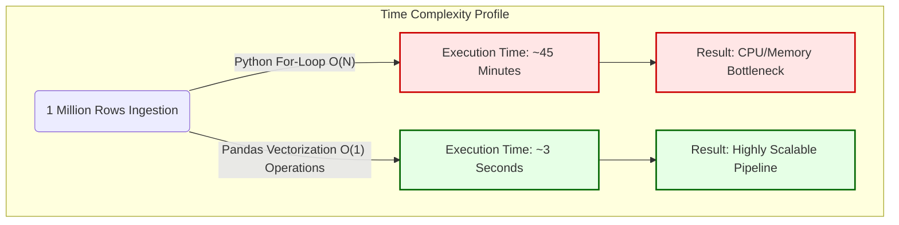

# Chapter 11: Performance & Scalability Considerations

Anti-Money Laundering systems are inherently "Big Data" systems. A mid-sized regional bank can process millions of transactions per day. If the analytical engine is poorly designed, memory overflows and connection timeouts will crash the compliance infrastructure entirely. 

This chapter explicitly addresses the architectural trade-offs and optimizations implemented to ensure this AML system scales mathematically and operationally.

## 11.1 Algorithm Complexity: Loop Iteration vs. Pandas Vectorization

As introduced in Chapter 5, shifting from traditional row-by-row iteration to vectorization was the most critical performance decision in this project. 

*   **The Big-O Notation Problem:** A standard Python `for` loop executing a basic arithmetic calculation across a 1,000,000-row dataset has a time complexity of `O(N)`. Because Python is an interpreted, dynamically typed language, every single row is evaluated independently, checking memory allocation and variable types one million times. 
*   **The Vectorized Solution:** Pandas is built on top of NumPy, which uses pre-compiled C code under the hood. When we command Pandas to sum a column (`df['amount'].sum()`), it treats the entire array as a single continuous block of memory. The operations are broadcasted simultaneously, mathematically reducing the execution time by orders of magnitude. 

### [Diagram: Performance Scaling Comparison]

**Diagram Explanation:**
*   Vectorization drastically flattens the execution curve. What would historically require massive multi-node clusters in legacy banks can be confidently processed in seconds utilizing `pandas` on a single modern server blade.

## 11.2 Database Throttling & Connection Strategies

Once the Isolation Forest marks accounts as anomalies, these flags must be permanently written to the persistent Database (SQLite/PostgreSQL) so the React Dashboard can display them.

A naive backend developer might write an iteration:
```python
# WARNING: Extremely Non-Performant Method
for res in anomalous_results:
    Alert.objects.create(account_id=res.id, score=res.score)
```

**The Connection Pool Crash:** Executing the code above on 10,000 alerts requires the Django ORM to explicitly open a database connection, execute an SQL `INSERT` statement, commit the row, and close the connection—10,000 separate times. This causes massive Disk I/O locking and will immediately crash the application server.

**The Solution: Bulk Creation**
We bypass row-by-row I/O bottlenecks using Django's `bulk_create` utility wrapped in optimal chunk sizing.

```python
# Optimal Implementation: Memory Batching
if alerts_to_create:
    Alert.objects.bulk_create(alerts_to_create, batch_size=1000)
```

**Code Explanation:**
*   Instead of writing to the DB immediately, we append the generated `Alert` objects entirely in server RAM (`alerts_to_create` list).
*   When the list is passed to `bulk_create` with `batch_size=1000`, Django translates this into a single massive SQL query (`INSERT INTO Alerts (...) VALUES (...), (...), (...)`) containing 1,000 rows at once.
*   This drops the total necessary Database transactions from 10,000 down to just 10.

## 11.3 Memory State Management During Large CSV Reads

While Pandas vectorization is incredibly fast, it requires loading the *entire* dataset into active server Memory (RAM). If a compliance officer uploads a 4GB CSV file, the server will throw a massive `MemoryError` and shut down if it lacks physical RAM.

Currently, the system is designed to handle moderately large batch flat files (e.g., up to ~250MB effectively) due to its dependency on `pd.read_csv()`. 

**Future Scalability Path:** If the bank demands processing of 10GB+ daily transaction graphs, the ingestion pipeline must be formally transitioned away from `pandas` into **Dask** or **Apache Spark**, which are designed specifically to partition DataFrames across multiple distributed worker nodes, preventing single-server memory limits.
