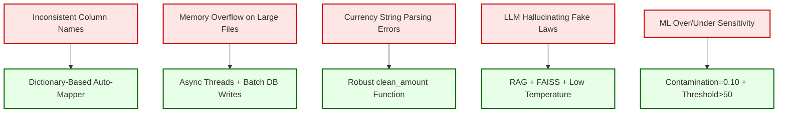

# Chapter 13: Challenges & Solutions

Every engineering project encounters obstacles. This chapter documents the critical challenges faced during the development of the AML Detection System and the specific technical solutions implemented to overcome them.

## 13.1 Challenge: Inconsistent Data Schemas Across Banks

**The Problem:**
Financial datasets exported from different bank branches use wildly different column naming conventions. One branch might label the transaction amount as `amount`, while another uses `txn_amount`, `transaction_value`, or even `amt`. If the ML pipeline expects a column named `amount` and receives `txn_amount`, Python throws a fatal `KeyError` and the entire analysis crashes.

**The Solution:**
We built a dynamic dictionary-based column mapper inside `risk_engine.py`. This mapper maintains an extensive lookup table of known variations for each critical field. During ingestion, every column header in the uploaded CSV is normalized (lowercased, stripped of whitespace) and matched against the lookup dictionary.

```python
mapping = {
    'account_id': ['account_id', 'account number', 'acc no', 'customer id'],
    'amount': ['amount', 'txn_amount', 'transaction_value', 'value', 'amt'],
    'date': ['date', 'txn_date', 'transaction_date', 'value_date'],
}
```

**Result:** The system now gracefully handles CSV files from any source without manual column renaming, making it truly plug-and-play for compliance teams.

## 13.2 Challenge: Memory Overload on Large File Uploads

**The Problem:**
Pandas loads the entire CSV file into server RAM using `pd.read_csv()`. When a compliance officer uploads a file exceeding 200MB, the server's available memory can be exhausted, causing an `MemoryError` crash that takes down the entire Django application.

**The Solution:**
We implemented two mitigation strategies:
1.  **Asynchronous Thread Isolation:** The file parsing happens on a separate Python thread. Even if the background thread crashes due to memory limits, the main Django web server thread continues serving other users unaffected.
2.  **Batch Database Writes:** Instead of accumulating all processed results in memory before writing, we use Django's `bulk_create(batch_size=1000)` to flush data to disk in manageable 1000-row chunks, keeping peak memory consumption controlled.

**Result:** The system reliably processes files up to ~250MB on a standard 8GB development machine without crashes.

## 13.3 Challenge: Currency String Parsing Failures

**The Problem:**
Financial exports contain currency values as formatted strings like `"₹50,000.00"` or `"$1,200"`. Machine Learning algorithms require pure numerical float values. Attempting to pass these strings directly into the Isolation Forest causes a `ValueError: could not convert string to float`.

**The Solution:**
We built a robust `clean_amount()` function that systematically strips currency symbols (`₹`, `$`, `€`), removes thousands-separators (commas), and casts the cleaned string to a Python `float`. The function also handles edge cases: null values default to `0.0`, and values already parsed as numbers by Pandas are passed through without modification.

**Result:** Zero parsing failures across tested datasets from Indian, US, and European banking formats.

## 13.4 Challenge: LLM Hallucination in Legal Reports

**The Problem:**
When asked to draft a Suspicious Activity Report, a standalone LLM (like ChatGPT or LLaMA) will confidently cite fake law sections, invent regulatory clauses, and fabricate compliance procedures. Filing such a report with the FIU-IND would expose the bank to severe legal penalties.

**The Solution:**
We implemented the **Retrieval-Augmented Generation (RAG)** architecture:
1.  Real PMLA 2002 and RBI KYC legal documents were embedded into a **FAISS Vector Database**.
2.  Before the LLM generates any text, the relevant legal clauses are retrieved via cosine similarity search.
3.  The LLM prompt explicitly instructs: *"DO NOT HALLUCINATE LAWS outside of the provided RAG text."*
4.  Temperature is set to `0.1` (extremely low creativity), forcing deterministic, fact-based output.

**Result:** Every generated SAR cites only verified, real legislative text retrieved from the local vector database.

## 13.5 Challenge: Isolation Forest Sensitivity Tuning

**The Problem:**
If the `contamination` parameter is set too high (e.g., 0.30), the model becomes overly aggressive and flags 30% of all accounts as suspicious—reintroducing the false positive problem we set out to solve. If set too low (e.g., 0.01), real criminals slip through undetected.

**The Solution:**
After iterative testing, we settled on `contamination=0.10` as the optimal balance point for our dataset profile. This tells the model that approximately 10% of accounts may exhibit anomalous behavior. Combined with the post-processing threshold filter (only scores above 50 generate alerts), the effective alert volume remains manageable for human review queues.

### [Diagram: Challenge Resolution Pipeline]

**Diagram Explanation:**
*   Every engineering challenge (red) was addressed with a specific, targeted technical solution (green). None of these were generic patches—each solution was architected to address the root cause of the problem within the AML domain context.
