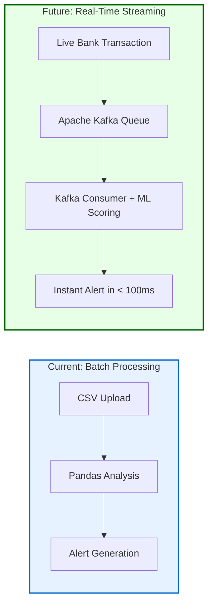

# Chapter 14: Future Scope & Enhancements

While the current system delivers a complete, functional AML detection and reporting pipeline, there are several high-impact enhancements that can elevate it from a batch-processing analytical tool to a real-time, enterprise-grade financial crime surveillance platform.

## 14.1 Real-Time Streaming with Apache Kafka

**Current Limitation:** The system processes transactions in batch mode—an analyst uploads a historical CSV file, and the engine analyzes it retroactively.

**Future Enhancement:** Integrate **Apache Kafka** as a real-time message broker. Banks would publish individual transactions to a Kafka topic as they occur. A dedicated Kafka consumer service would continuously ingest these events, run them through the pre-trained Isolation Forest model (loaded from the `.joblib` file), and generate alerts in real-time—within milliseconds of a suspicious transaction occurring.

### [Diagram: Batch vs Real-Time Architecture]

## 14.2 Graph Neural Networks for Network Detection

**Current Limitation:** Round-trip detection is limited to 1-degree loops (A → B → A). Multi-hop laundering networks (A → B → C → D → A) are currently invisible.

**Future Enhancement:** Implement **Graph Neural Networks (GNNs)** using libraries like **PyTorch Geometric** or **Neo4j Graph Database**. Every account becomes a "node" and every transaction becomes an "edge." GNNs can traverse these edges to discover complex, multi-layered laundering rings that span dozens of intermediary accounts across different geographies.

## 14.3 PostgreSQL Migration for Production Scale

**Current Limitation:** The system uses SQLite, which is file-based and supports only single-writer concurrency. In a production environment with multiple analysts querying simultaneously, SQLite becomes a bottleneck.

**Future Enhancement:** Migrate to **PostgreSQL** with connection pooling (via `pgbouncer`). PostgreSQL supports concurrent read/write operations, advanced indexing, and can handle millions of records without performance degradation.

## 14.4 Explainable AI (XAI) with SHAP Values

**Current Limitation:** While we tag alerts with the specific typology that triggered them (Structuring, Mule, etc.), we don't quantify exactly how much each feature contributed to the final risk score.

**Future Enhancement:** Integrate **SHAP (SHapley Additive exPlanations)** values. SHAP mathematically decomposes the Isolation Forest's decision for each account, showing exactly which feature (e.g., "structuring_count contributed 45% to the risk score") drove the anomaly detection. This provides regulators with mathematically auditable AI decisions—a growing regulatory requirement globally.

## 14.5 Multi-Language SAR Generation

**Current Limitation:** The RAG system generates SARs only in English, citing Indian PMLA laws.

**Future Enhancement:** Expand the FAISS vector database to include compliance frameworks from multiple jurisdictions:
*   **EU Anti-Money Laundering Directives (AMLD6)**
*   **US Bank Secrecy Act (BSA) / FinCEN regulations**
*   **FATF (Financial Action Task Force) recommendations**

The LLM prompt can be dynamically adjusted to generate reports in the target jurisdiction's language and legal framework, enabling the system to serve multinational banking institutions.

## 14.6 Automated Model Retraining Pipeline

**Current Limitation:** The Isolation Forest model is trained once during the initial data upload. As criminal behavior evolves over time, the model's definition of "normal" becomes stale.

**Future Enhancement:** Implement an **MLOps retraining pipeline** using tools like **MLflow** or **Kubeflow**. The system would automatically retrain the Isolation Forest on a scheduled basis (e.g., weekly) using the latest transaction data, version the model artifacts, and deploy the updated model to production with zero downtime.
