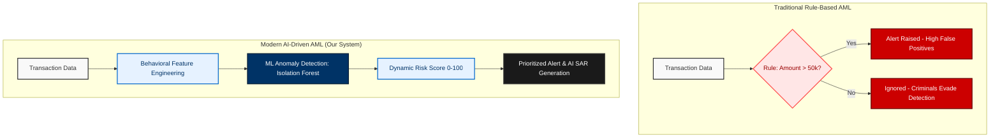

# Chapter 1: Executive Summary

## 1.1 Objective of the AML Detection System
The primary objective of the Anti-Money Laundering (AML) Detection System is to identify, analyze, and report sophisticated financial crimes hidden within vast amounts of transactional data. 

Money laundering involves complex techniques—like breaking down large sums into smaller transactions (Structuring) or rapidly moving funds through intermediate accounts (Money Mules)—designed to bypass traditional banking alert thresholds. This project aims to solve this problem by building a scalable, AI-powered pipeline that ingests raw banking data, dynamically scores account risk based on behavioral deviations, and computationally generates legally-grounded compliance reports.

The end goal is to drastically reduce the "false positive" noise that burdens modern compliance teams, while automating the heavy lifting of drafting Suspicious Activity Reports (SARs) using Generative AI.

## 1.2 The Shift from Rule-Based to AI-Driven AML Architecture
Historically, financial institutions have relied on **Boolean-logic (Rule-Based) systems**. A traditional system might have a hardcoded rule stating: *“If a transaction exceeds ₹50,000, trigger an alert.”* 

While simple to implement, these legacy systems face two massive failures:
1. **High False Positive Rates:** Perfectly legal business anomalies trigger alerts simply for crossing a static threshold, wasting analysts' time.
2. **Predictable Evasion:** Criminals understand these static rules. If the limit is ₹50,000, they will systematically deposit ₹49,000 to remain invisible.

This project shifts the paradigm to an **AI-Driven Architecture**. Instead of asking, *"Did this account cross a hardcoded line?"*, the system asks, *"Is this account's behavioral geometry fundamentally different from the normal population?"* By engineering behavioral features (like velocity of funds and structuring counts) and feeding them into an unsupervised Machine Learning model, the system identifies the *shape* of money laundering rather than just its size.

### [Diagram: Evolution of AML Systems]

## 1.3 Key Technical Innovations (Unsupervised ML & RAG)
This project brings CDAC-level engineering depth through two critical technical pillars: Machine Learning and Artificial Intelligence.

**1. Unsupervised Machine Learning (Isolation Forest)**
Since money laundering represents a fraction of a percent of global banking transactions, we face a massive class imbalance problem. We utilize the **Isolation Forest (iForest)** algorithm from `scikit-learn` to isolate anomalies. Because iForest works by recursively partitioning data, normal data points (the vast majority) require many partitions to be isolated, whereas anomalous (laundering) patterns are isolated very quickly near the root of the decision trees. This yields a mathematically objective anomaly score.

**2. Legal Intelligence via RAG (Retrieval-Augmented Generation)**
Detecting an anomaly is only half the battle; an analyst must still prove *why* it violates the law. We implemented a Generative AI layer using the **Groq LLM** (Llama-3.3-70b-versatile). To prevent the AI from hallucinating fake laws, we built a **Retrieval-Augmented Generation (RAG)** system powered by a FAISS Vector Database. The vector DB stores embeddings of the actual **Prevention of Money Laundering Act, 2002 (PMLA)**. When generating a report, the LLM is strictly constrained to synthesize its argument using only the retrieved legal acts matching the specific transaction typology.

## 1.4 Project Scope and Boundaries
To maintain focus on core Data Engineering and ML Architecture, the scope of this project is explicitly bounded:

**In-Scope (Focus Areas):**
*   **Data Pipeline:** Asynchronous parsing and vectorized processing of large CSV/Excel transaction datasets using Pandas.
*   **Machine Learning:** Feature engineering (Structuring, Mule bridging) and deployment of the Isolation Forest risk engine.
*   **Generative AI:** Building the FAISS embedding pipeline and LangChain prompts for automated SAR generation.
*   **Backend Subsystems:** Django ORM scaling via bulk insertions to handle high-throughput analytical ingestion.

**Out-of-Scope (Boundaries):**
*   **Real-time Streaming:** The current analytical engine operates on batch ingestion (CSV uploads) rather than real-time Kafka streaming (planned for future scope).
*   **Frontend UI Complexity:** While a React dashboard is provided to trigger the APIs and visualize data, deep UI/UX animation mechanics or advanced frontend state management are secondary to the backend intelligence engine.
*   **Core Banking Mainframe Integration:** This system acts as an analytical overlay, not a transactional ledger; it assumes data is provided via periodic historical extracts.
