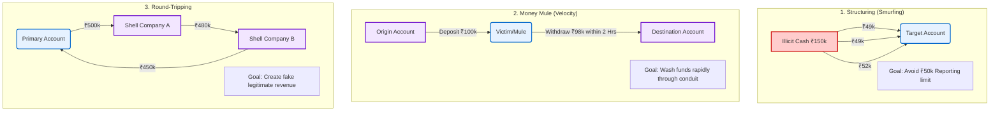

# Chapter 2: Problem Definition & AML Industry Context

## 2.1 The Cost of False Positives in Traditional AML
The global financial system currently relies on Transaction Monitoring Systems (TMS) that use strict, threshold-based logic to flag suspicious activity. For example, if a compliance threshold mandates scrutiny on all international transfers above ₹1,000,000, the system blindly alerts on every single transaction meeting that criteria.

This approach creates a severe operational bottleneck known as **The False Positive Paradox**. Industry statistics indicate that traditional AML systems generate false positive rates exceeding 95%. This means that out of 100 alerts generated by the system, 95 are legitimate business transactions. 
*   **Operational Strain:** Highly paid compliance analysts spend the majority of their time closing useless alerts rather than investigating true financial crime.
*   **Systemic Risk:** Because analysts are overwhelmed by the sheer volume of "noise," genuine sophisticated laundering activities (the "signal") often slip through unnoticed.

Our system fundamentally attacks this problem. By using an Isolation Forest ML model, we transition from rigid thresholding to dynamic behavioral scoring, isolating statistically rare events rather than standard high-value business operations.

## 2.2 Modern Typology Challenges: Structuring, Mule Accounts, Round-Tripping
Money launderers are highly aware of static banking thresholds and have developed sophisticated "typologies" (methods) to orchestrate money movement completely under the radar. Traditional linear systems struggle deeply to detect these non-linear patterns.

Our AML system is engineered to extract features for three primary typologies:

1.  **Structuring (Smurfing):** The act of breaking down a large sum of illicit cash into numerous smaller deposits deliberately designed to fall just below the mandatory reporting threshold (e.g., repeatedly depositing ₹49,900 to avoid a ₹50,000 cash reporting limit).
2.  **Money Mules (Velocity Exploitation):** Criminals recruit "mules" (often vulnerable individuals) to temporarily hold funds. A victim’s money is transferred into the mule account and is almost immediately withdrawn or transferred out to a disparate geographic location. The key behavioral indicator is a nearly 1:1 rapid in-and-out velocity with minimal resting time.
3.  **Round-Tripping (Network Obfuscation):** A complex scheme where funds are transferred through a maze of shell companies and offshore accounts, only to eventually return to the original sender. Visually, this creates a cyclical graph of money movement intended to legitimize the funds.

### [Diagram: Common Money Laundering Typologies]

**Diagram Explanation:**
*   **Structuring:** The diagram shows large illicit cash being broken into smaller sub-50k deposits to evade statutory triggers.
*   **Money Mule:** Emphasizes *velocity*; the account holds funds for mere hours before passing them on, acting only as a temporary bridge.
*   **Round-Tripping:** Shows the cyclical nature of funds leaving the primary account and returning disguised as legitimate business income after shedding layers in shell companies.

## 2.3 Regulatory Burden: PMLA 2002 and RBI KYC Master Directions
Detecting a crime computationally is only the first step. For a bank to take action (such as freezing an account), they must file a formal **Suspicious Transaction Report (STR) / Suspicious Activity Report (SAR)** to the Financial Intelligence Unit (FIU-IND). 

This reporting is governed primarily by two frameworks in India:
*   **The Prevention of Money Laundering Act, 2002 (PMLA):** The core legislative act defining the offense of money laundering, the obligations of banking companies, and the powers of attachment.
*   **RBI Master Direction - Know Your Customer (KYC) Direction, 2016:** The operational guidelines issued by the Reserve Bank of India mandating continuous transaction monitoring and exact timelines for reporting suspicious activity.

Drafting a SAR requires immense labor. An analyst must manually extract transaction evidence, map it to the observed typology, and correctly cite the relevant sections of PMLA or RBI guidelines. This operational friction is precisely why our architecture implements a RAG-based Generative AI LLM—to computationally synthesize the regulatory mapping and draft the SAR markdown autonomously.

## 2.4 Gap Analysis: Where Current Boolean Logic Systems Fail

To summarize the technical justification for our AI-driven architecture, we present a gap analysis comparing legacy systems to our implemented solution:

| Capability | Legacy Boolean System | Our AI-Driven AML System |
| :--- | :--- | :--- |
| **Logic Foundation** | Hardcoded `IF/THEN` rules (e.g., `IF txn > 50k`) | Unsupervised Anomaly Scoring (Isolation Forest) |
| **Adaptability** | None. Fails if criminals change amounts by ₹1. | High. Detects behavioral deviations regardless of specific exact amounts. |
| **False Positive Rate** | > 95% (Drowns analysts in noise) | Low. Only alerts on isolated, statistically anomalous financial paths. |
| **Typology Detection** | 1-Dimensional (Checks singular thresholds) | Multi-Dimensional (Correlates Velocity, Volatility, and Structuring counts) |
| **Compliance Reporting** | 100% Manual Human Labor | Automated via Retrieval-Augmented Generation (RAG) |

By addressing these core gaps, our system elevates transaction monitoring from a basic data-filtering exercise into an intelligent, investigative compliance engine.
