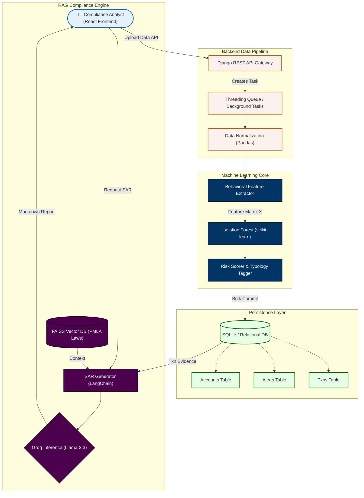
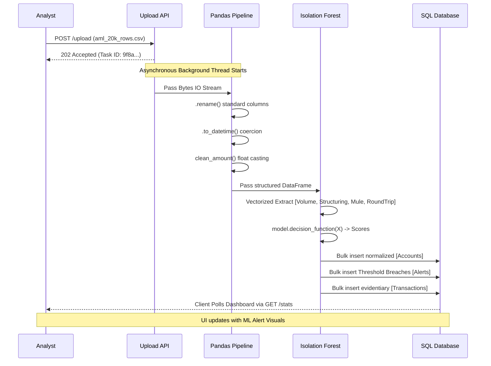

# Chapter 3: System Architecture Overview

This chapter outlines the high-level design of the AML Detection System. The architecture is explicitly decoupled, relying on a backend analytical engine (Django/Python) to handle heavy data ingress, feature extraction, ML inference, and RAG execution, while serving a separate frontend analytic dashboard to compliance officers.

## 3.1 High-Level Component Interaction

The system operates across three distinct computational phases: **Ingestion**, **Intelligence**, and **Investigation**. 

1.  **Ingestion (Data Parsing):** Accepts large transactional datasets (CSV/Excel format), validates the schemas, normalizes the columns, and commits the records to a background queue.
2.  **Intelligence (ML Pipeline):** A dedicated background thread orchestrates the core analytics. It extracts vectorized features via `pandas` and runs the transactional geometries through the `IsolationForest` risk engine to calculate probabilistic threat scores.
3.  **Investigation (RAG & UI):** Alerts breaching the mathematical threshold are pushed to the database. Compliance officers reviewing these alerts can trigger the LLM to fetch PMLA laws from the Vector Database and generate legally sound Suspicious Activity Reports (SARs).

### [Diagram: End-to-End System Architecture]

## 3.2 Core Technology Stack Justification

Every tool selected for this architecture directly addresses the unique challenges of processing structured financial data at scale.

### 3.2.1 Python Ecosystem for the Data Science Pipeline
Python was chosen as the primary backend language. Given that the core innovation of this project lies in data manipulation and ML scoring, Python’s ecosystem is unrivaled.
*   **The Framework (`Django` & `DRF`):** Django was selected over micro-frameworks like Flask/FastAPI because of its robust internal ORM (Object-Relational Mapper) which allows us to quickly model complex entities (Accounts bounding to Alerts, Alerts mapping to Transactions).
*   **Data Processing (`Pandas` & `NumPy`):** Native Python arrays `.append()` fail in memory when processing millions of banking rows. We rely on underlying C-based NumPy arrays accessed through Pandas to execute *vectorized* mathematical operations.

### 3.2.2 Relational Data Modeling (SQLite)
Financial records are inherently relational. An `Alert` cannot exist without a parent `Account`, and an `Account` relies on child `Transactions`. 
*   We utilize **SQLite** (structured for upgrade to PostgreSQL in production environments).
*   The Django ORM is strictly configured to execute `bulk_create()` methods. Instead of establishing 10,000 separate database connection locks to write 10,000 alerts, objects are arrayed in memory and committed in single transaction blocks.

### 3.2.3 Vector Database (FAISS) and Groq LLM Inference
For the compliance automation facet of the system, we required a mechanism to "teach" an LLM Indian financial law.
*   **FAISS (Facebook AI Similarity Search):** A library specialized for dense vector clustering. We chunked the PMLA (2002) legal document, embedded the text into vectors, and loaded them into FAISS. When an alert involves "Structuring", the RAG engine queries the FAISS index for vectors geometrically closest to the word "Structuring".
*   **Groq API (Llama-3.3-70b-versatile):** Selected over OpenAI for its LPU (Language Processing Unit) architecture, Groq delivers inference at massive speed, ensuring the compliance officer does not wait minutes for a report to generate.

## 3.3 Data Flow Pipeline

The movement of data through the system is strictly unidirectional, guaranteeing that the mathematical purity of the raw data is never mutated, only scored.

### [Diagram: Data Pipeline DFD Level 1]

In the subsequent chapters, we step granularly into the code and mathematics managing each specific segment of this architectural flow, starting with the Data Ingestion Phase.
