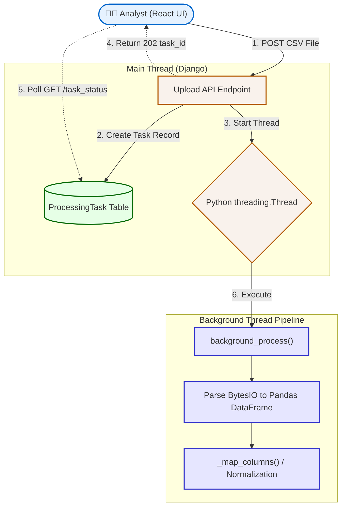

# Chapter 4: Data Ingestion & Normalization Layer

The intelligence of any Machine Learning model is capped by the quality of its training data. In banking, data is historically messy—dates have inconsistent formats, column names change depending on the extracting branch, and missing values are common. This chapter details how the AML system ingests massive flat files (CSV/Excel) and normalizes them into a pristine `pandas` DataFrame ready for mathematical modeling.

## 4.1 Asynchronous Batch Ingestion

To score thousands or millions of transactions, the system must ingest large flat files uploaded by the compliance team. 

**The Challenge:** Reading a 100MB CSV file into memory, preprocessing it, and running an ML model can take several seconds to minutes. If this process occurs on the main server thread, the HTTP request hangs, and the entire dashboard UI freezes for the user.

**The Solution:** The Django backend strictly decouples file ingestion from analytical processing via Background Threading.

1.  **Acceptance:** The API endpoint (`UploadView`) validates the multipart file payload.
2.  **Task Instantiation:** It immediately creates a `ProcessingTask` database record with a status of `Pending` and generates a unique `task_id` (UUID).
3.  **Thread Handoff:** The file's byte data is passed directly to the `background_process` function executing on a separate Python thread.
4.  **Instant Return:** The REST API instantly returns an HTTP `202 Accepted` to the frontend with the `task_id`. The frontend uses this ID to poll for a progress bar, preventing UI blocking.

### [Diagram: Asynchronous Data Ingestion Pipeline]


**Diagram Explanation:**
*   **Main Thread (Django):** When the Analyst uploads the file, the Main API endpoint ONLY handles saving a preliminary record to the database (`ProcessingTask Table`) and dispatching the heavy lifting to the `Threadpool`. Because it doesn't parse the file itself, it can return an HTTP 202 code ("Accepted") almost instantly.
*   **Polling Mechanism:** The React Client now holds a `task_id` and periodically queries the Database (`TaskDB`) to update a loading bar.
*   **Background Thread Pipeline:** Entirely isolated from the main web server, this worker thread reads the binary data into a `Pandas DataFrame` and begins the heavy CPU process of normalization and data cleaning without interrupting other users on the dashboard.

## 4.2 Schema Mapping and Column Normalization

Financial datasets lack strict naming conventions. One bank branch might export a column as `account_id`, while another exports it as `customer id` or `acc no`. To prevent the ML pipeline from crashing due to `KeyError` exceptions, we dynamically map variant column names to our internal schema.

Inside the `RiskEngine._map_columns()` method, we maintain a dictionary of known variations. The system iteratively checks the raw DataFrame columns against this dictionary.

```python
def _map_columns(self):
    """Map common column name variations to internal names"""
    mapping = {
        'account_id': ['account_id', 'account', 'account number', 'acc no', 'customer id', 'id'],
        'date': ['date', 'transaction date', 'txn date', 'date_time'],
        'time': ['time', 'transaction time', 'txn time'],
        'amount': ['amount', 'transaction amount', 'value', 'txn amount', 'debit', 'credit'],
        'type': ['type', 'transaction type', 'txn type', 'description'],
        'related_account': ['related_account', 'to', 'from', 'counterparty', 'beneficiary']
    }

    found_mapping = {}
    for internal_name, variations in mapping.items():
        for col in self.df.columns:
            if str(col).lower().strip() in variations:
                found_mapping[col] = internal_name
                break
    
    # Rename the DataFrame columns in-place
    self.df = self.df.rename(columns=found_mapping)
```

**Code Explanation:**
*   **`mapping` Dictionary:** This maps our system's required internal column names (e.g., `'account_id'`) to a list of possible variations found in wild data (e.g., `'account number'`, `'customer id'`).
*   **The Nested Loop:** The code iterates through the actual columns in the uploaded CSV (`self.df.columns`). For each column, it converts the name to lowercase and strips trailing spaces (`str(col).lower().strip()`). If this cleaned name exists in our variation list, it maps the CSV column name to our required internal name.
*   **`self.df.rename()`:** Finally, the `pandas` DataFrame columns are updated in-place using the matched dictionary. This guarantees all downstream ML functions receive exact, expected headers.
If critical columns (e.g., `account_id`, `amount`, `date`) are entirely missing after normalization, the task fails gracefully.

## 4.3 Data Cleaning and Type Casting

Machine learning models require strictly typed numerical and temporal data. String fields cannot be processed algebraically. 

### 4.3.1 Resolving Missing Temporal Attributes
Velocity of money is a prime indicator of money laundering (e.g., Mule networks). Therefore, precise datetime formatting is required. 

The `_prepare_data()` pipeline handles this by gracefully combining isolated `date` and `time` columns. If the `time` column was not provided in the CSV extract, the system defaults the time to `00:00:00` to prevent `NullTypeError` cascading downstream.

```python
if 'time' not in self.df.columns:
    self.df['datetime'] = pd.to_datetime(self.df['date'])
else:
    dates = self.df['date'].astype(str)
    times = self.df['time'].astype(str)
    # Concatenate and cast to pandas datetime objects
    self.df['datetime'] = pd.to_datetime(dates + ' ' + times)
```

**Code Explanation:**
*   **Missing Time Handling:** The `if 'time' not in self.df.columns` block checks if the dataset only provided dates. If so, `pd.to_datetime` automatically assigns a default time of Midnight (`00:00:00`) to every row. This prevents velocity calculations from crashing.
*   **String Concatenation:** In the `else` block, where both date and time exist, pandas uses fast vectorized string casting (`.astype(str)`) to combine the date and time strings together with a separator space (e.g., `"2023-10-01" + " " + "14:30:00"`). 
*   **Datetime Casting:** The combined string series is parsed by `pd.to_datetime()` into high-performance 64-bit datetime objects. These objects allow us to natively subtract timestamps later to calculate the rapid velocity required for detecting Mule accounts.

### 4.3.2 Robust Currency String Parsing
Currencies are almost always exported as formatted strings (e.g., `"₹50,000.00"` or `"$1,200"`). These strings must be cast to standardized floating-point integers for distance-based ML algorithms (like Isolation Forest) to function.

We apply a robust `clean_amount` lambda function across the entire pandas series effectively stripping currency symbols and delimiters.

```python
def clean_amount(val):
    if pd.isna(val): return 0.0
    if isinstance(val, (int, float)):
        return float(val)
    # Strip symbols and thousand separators, cast string to float
    return float(str(val).replace('₹', '').replace(',', '').replace('$', ''))

# Apply transformation vector-wide
self.df['amount'] = self.df['amount'].apply(clean_amount)
```

**Code Explanation:**
*   **Null Checks:** `if pd.isna(val): return 0.0` ensures that empty cells in the financial CSV don't throw an error; they are safely converted to `0.0`.
*   **Type Checking Optimization:** `if isinstance(val, (int, float))` acts as a performance shortcut. If pandas properly parsed a cell as a number, it skips the expensive string manipulation entirely.
*   **String Manipulation:** For stubborn strings like `"₹50,000"`, the `.replace()` method forcibly removes specific currency symbols and commas. The remaining string `"50000"` is then algebraically cast as a `float`.
*   **The `.apply()` Function:** This broadcasts the `clean_amount` logic iteratively across the entire `amount` column in the DataFrame, ensuring every row is mathematically ready for the Isolation Forest matrix.

Once this normalization layer completes, `self.df` represents a mathematically pure matrix ready for Behavioral Feature Engineering.
