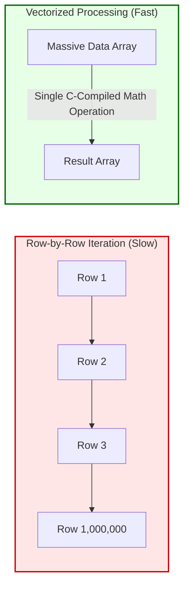

# Chapter 5: Behavioral Feature Engineering

Machine Learning models like Isolation Forest cannot understand abstract concepts like "Money Laundering." They only understand geometry: numbers moving through a multi-dimensional matrix. **Behavioral Feature Engineering** is the critical process of translating human financial behavior into mathematically quantifiable vectors. 

This chapter explains how our system constructs the Feature Matrix (`X`) required by the ML model.

## 5.1 The Need for Vectorized Feature Extraction over For-Loops

A massive engineering bottleneck in Data Science is loop iteration. If an analyst provides a CSV with 1,000,000 transactions, using a standard Python `for` loop to calculate every account's total volume would require 1,000,000 separate memory operations, taking several minutes to complete.

Our Risk Engine (`risk_engine.py`) strictly forbids row-by-row iteration. Instead, we use **Pandas Vectorization**. Vectorized operations pass instructions down to the underlying C-compiled libraries (like NumPy). 

### [Diagram: Vectorization vs. Loop Iteration]

**Diagram Explanation:**
*   Unlike traditional loops that evaluate logic one row at a time (crashing memory on millions of rows), Vectorization applies mathematical transformations (like group-bys or sums) across entire columns simultaneously using optimized C-libraries. This reduces processing time from minutes to milliseconds.

For example, our aggregation metrics are calculated instantly using `.groupby()`:

```python
# 1. Total Volume & Count Vectors
stats = df.groupby('account_id')['amount'].agg(['sum', 'count'])
stats = stats.rename(columns={'sum': 'total_volume', 'count': 'transaction_count'})
```

**Code Explanation:**
*   **`.groupby('account_id')`**: This splits the massive table into virtual sub-tables for every unique account instantly.
*   **`.agg(['sum', 'count'])`**: This simultaneously calculates the total monetary volume (sum) and the total number of transactions (count) for each account. These two metrics form the foundational numeric vectors of our feature matrix.

## 5.2 Structuring (Smurfing) Vector Engineering
Structuring occurs when launderers keep transaction amounts deliberately below a reporting threshold (e.g., ₹50,000). To quantify this behavior, we need to count how many times an account hits this specific mathematical bracket.

```python
# 2. Structuring Vector Calculation (45k - 50k)
df['is_structuring'] = (df['amount'] >= 45000) & (df['amount'] < 50000)
structuring = df.groupby('account_id')['is_structuring'].sum().rename('structuring_count')
```

**Code Explanation:**
*   **Boolean Masking:** `(df['amount'] >= 45000) & (df['amount'] < 50000)` creates a True/False column instantly. A `True` equals `1`, meaning the transaction was dangerously close to the 50k threshold.
*   **Summing Bools:** We group by the account and `.sum()` the True values. If Account A has a `structuring_count` of 12, it means they executed 12 transactions directly beneath the legal radar. This forms our third feature vector.

## 5.3 Temporal Velocity Vectors (Mule Scoring)
Money Mule networks are characterized by distinct temporal behaviors (time relationships). A Mule will receive illicit funds (Deposit) and act as a conduit, quickly moving those funds elsewhere (Withdrawal). The "Velocity" of this money is extremely high. 

To engineer this feature, we must mathematically relate a row to the row that happened right before it, sorted by time.

```python
# 3. Money Mule Score (Rapid In/Out Velocity)
df = df.sort_values(['account_id', 'datetime'])

# Shift data mathematically down by 1 row within each account grouping
df['prev_amount'] = df.groupby('account_id')['amount'].shift(1)
df['prev_type'] = df.groupby('account_id')['type'].shift(1)

# Calculate Time Delta in seconds
df['time_diff'] = df.groupby('account_id')['datetime'].diff().dt.total_seconds()

# Flag velocity exploitation 
df['is_mule'] = (df['type'] == 'Withdrawal') & \
                (df['prev_type'] == 'Deposit') & \
                (df['time_diff'] <= 86400) & \
                (df['amount'] >= 0.95 * df['prev_amount']) & \
                (df['amount'] <= 1.05 * df['prev_amount'])

mule_scores = df.groupby('account_id')['is_mule'].sum().rename('mule_score')
```

**Code Explanation:**
*   **`.shift(1)`**: This is the core vector trick for time-series data. It copies the previous transaction’s amount and type onto the current transaction's row. We now have the "Past" and "Present" available for math on a single line.
*   **`.diff().dt.total_seconds()`**: Calculates the exact time difference between the current transaction and the previous one, in seconds.
*   **The Velocity Logic (`is_mule`)**: We set a flag to `True` ONLY IF all these conditions are met:
    1.  The past txn was a Deposit.
    2.  The current txn is a Withdrawal.
    3.  The time difference is under 24 hours (`86400` seconds).
    4.  The withdrawal amount matches the deposit amount by a 5% delta (`0.95` to `1.05`), proving "funds passing through".
*   We then sum these flags to create the `mule_score` vector.

## 5.4 Relational Features (Round-Trip Generation)
To track if an account is bouncing money back and forth with related entities (Round Tripping), we calculate interaction frequencies between counterparties.

```python
# 4. Round Trip Count Vector
round_trips = df[df['related_account'].notna()].groupby(['account_id', 'related_account']).size()
round_trip_counts = round_trips[round_trips > 1].groupby('account_id').count().rename('round_trip_count')
```

**Code Explanation:**
*   We group by BOTH `account_id` and `related_account`. 
*   If the `.size()` of interactions between Account A and Counterparty X is greater than 1, it implies reciprocal movement (A gave to X, X gave back to A). 
*   We sum the total number of distinct counterparties engaging in this behavior to generate the `round_trip_count` vector.

## 5.5 Matrix Consolidation
Finally, these isolated vectors are horizontally concatenated into our finalized `pandas DataFrame`. 

```python
# Combine all features into Matrix X
features_df = pd.concat([stats, structuring, mule_scores, round_trip_counts], axis=1).fillna(0)
```

This `features_df` is the mathematical matrix (`X`) that will be passed into the Isolation Forest in Chapter 7.
