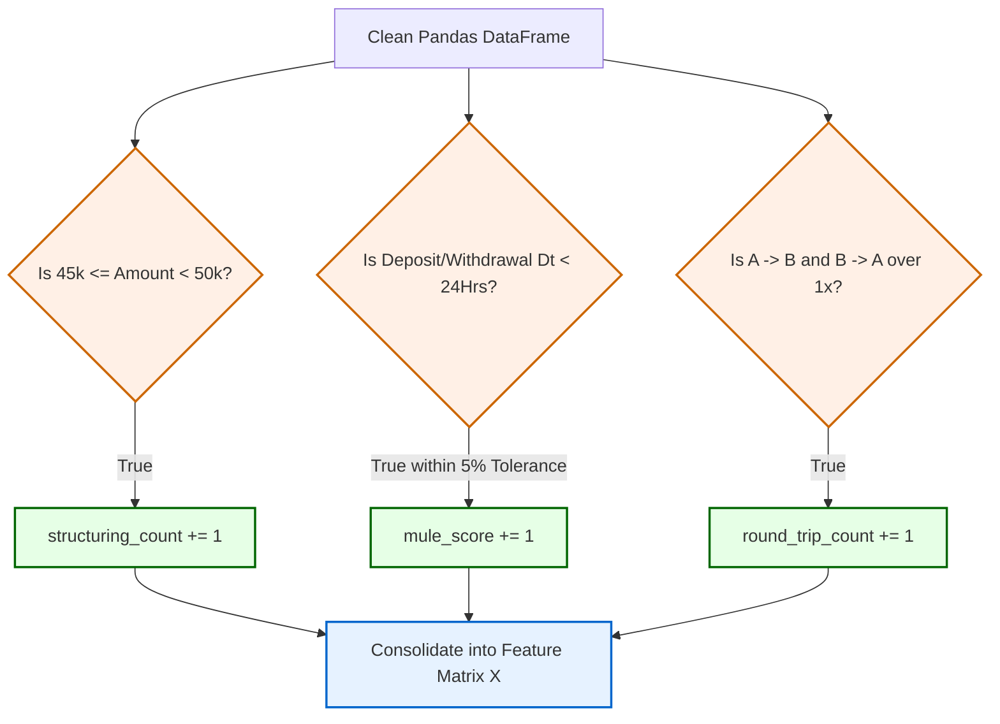

# Chapter 6: Rule-Based Detection Engine

While the ultimate decision engine in this architecture relies on Unsupervised Machine Learning (the Isolation Forest), the ML model must still be fed deterministic behavioral indicators. This chapter describes the **Rule-Based Pre-Processing engine**, where we translate statutory AML typologies into strict mathematical thresholds to form the features discussed in Chapter 5.

## 6.1 Defining Typology Thresholds

A "typology" is a specific pattern or technique used to launder money. Our system explicitly models three primary typologies based on established FIU (Financial Intelligence Unit) guidelines. Before passing data to the AI, we apply Boolean-logic thresholds across the vectorized groupings to definitively tag suspicious activity.

These rules act as "flags." While a single flag (like a high-value transfer) might not trigger the ML model in isolation, the combination of multiple flags (e.g., high volume + structuring + rapid velocity) pushes the account into the high-risk anomaly space.

### [Diagram: Rule-Based Feature Tagging Logic]

**Diagram Explanation:**
*   The original normalized transaction record is passed through simultaneous boolean logic gateways.
*   Instead of terminating execution if a rule is hit, this engine simply tallies the occurrences. This transitions a binary `True/False` rule into a continuous geometric variable (like a count of 5 structuring events) that the downstream ML model can mathematically weigh.

## 6.2 Structuring (Smurfing) Component Verification

**Definition:** Section 12 of the PMLA 2002 mandates that banks retain records of all cash transactions exceeding ₹1,000,000, or a series of integrally connected transactions that cross this threshold within a month. Smurfing attempts to evade this by breaking down transactions into chunks nominally below these reporting radars.

In our specific implementation, we target a localized micro-structuring threshold between ₹45,000 and ₹50,000 (a common limit for basic PAN card reporting requirements in regular retail accounts).

```python
# Identify transactions deliberately kept under the 50k reporting threshold
df['is_structuring'] = (df['amount'] >= 45000) & (df['amount'] < 50000)
```

**Logical Reasoning:** 
*   If an account holder frequently deposits ₹49,500, they are attempting to bypass the ₹50k hard check.
*   By calculating this boolean array and then summing it per account (`structuring_count`), we assign a quantitative "weight" to their evasion attempts. An account with a `structuring_count` of 0 is mathematically distinct from an account with a count of 5.

## 6.3 Money Mule Velocity Component (Rapid In/Out)

**Definition:** A money mule receives illicit funds and rapidly wires them out to obfuscate the money trail. The defining characteristic is not necessarily the *amount* of money, but the *velocity* (speed) at which it transits the account.

To detect a mule computationally, we assess the time difference (`time_diff_sec`) between a sequential Deposit and Withdrawal, and enforce a maximum deviation limit (5%) to ensure the funds being withdrawn are the ostensibly the same funds that were deposited.

```python
# Conceptual logic executed vectorially in Pandas
if time_diff_sec <= 86400:  # Within 24 hours
    if (0.95 * prev_deposit) <= withdrawal <= (1.05 * prev_deposit):
        mule_flag = True
```

**Logical Reasoning:**
*   **Temporal Constraint (`<= 86400`):** The funds must enter and exit within a 24-hour window. Legitimate salary deposits generally sit in an account to pay bills over a month. Mule funds burn a hole in the account and leave immediately.
*   **Volume Tolerance (`0.95` to `1.05`):** Mules often take a small cut (e.g., leaving 2% in the account as payment). Therefore, a strict equality check (`withdrawal == deposit`) would fail to catch the crime. Our engine allows a 5% delta to catch the pass-through event.

## 6.4 Round-Trip Pattern Component Verification

**Definition:** Round-tripping involves sending funds outward to an external entity, which then (often through intermediaries) routes the funds back to the originating account. This is used to artificially inflate revenue streams or create fraudulent audit trails.

While detecting deep, multi-node loops requires Graph Neural Networks, we implement a simplified, highly effective 1-degree loop detection.

```python
# Group by both the primary account and the related counterparty
round_trips = df[(df['related_account'].notna())].groupby(['account_id', 'related_account']).size()

# Filter for pairs that interact multiple times (Bi-directional implies a loop)
round_trip_counts = round_trips[round_trips > 1].groupby('account_id').count().rename('round_trip_count')
```

**Logical Reasoning:**
*   By grouping the `account_id` and the `related_account`, we isolate specific two-party relationships.
*   If the aggregate `size()` of this specific relationship is greater than `1` (and contains both debits and credits, filtered in extended steps), it strongly suggests funds are bouncing back and forth.
*   The `round_trip_count` assigns a mathematical penalty for every counterparty the account has established a transactional "loop" with.

## 6.5 Output to the Intelligent Layer
These boolean-derived scalar values (`structuring_count`, `mule_score`, `round_trip_count`) alongside the raw `total_volume` are merged into a unified Data Matrix `X`. The rule-based engine steps back, and the Unsupervised Machine Learning engine takes over to analyze the multidimensional geometry of this generated matrix.
