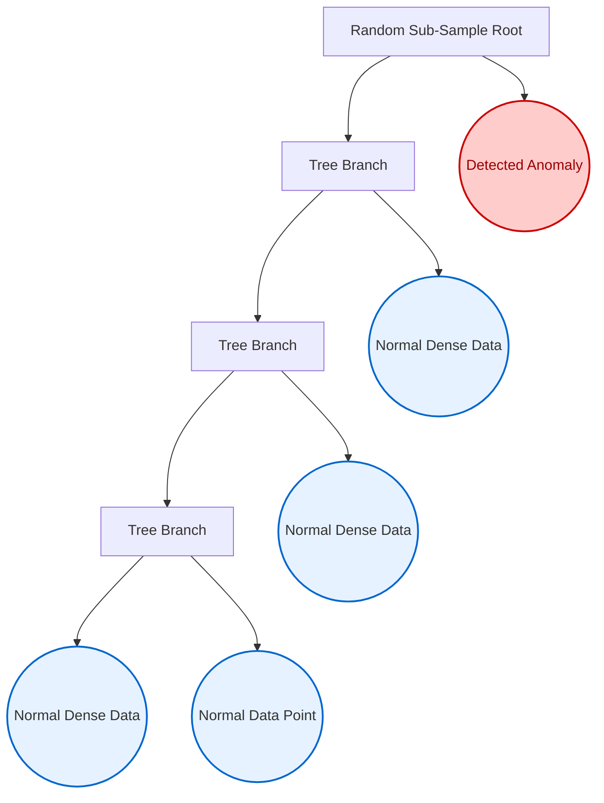

# Chapter 7: Machine Learning Anomaly Detection

This chapter addresses the core intelligence engine of the Anti-Money Laundering architecture. After the rule-based component successfully generates independent behavioral vectors (Structuring Count, Mule Score, Round-Trips, Total Volume), the system requires an objective methodology to weigh these disparate elements and answer one unified question: *"Is this account's overall behavior anomalous?"*

We solve this using Unsupervised Machine Learning, specifically the **Isolation Forest** algorithm.

## 7.1 Unsupervised Learning in the AML Context

In most machine learning problems (like Image Recognition), algorithms use **Supervised Learning**. They are trained on millions of pre-labeled examples ("This is an Apple", "This is an Orange"). 

In Financial Crime Compliance, supervised learning models often fail because criminals actively mutate their behavior specifically to look like normal banking traffic. Furthermore, banks rarely have thousands of perfectly labeled "Money Launderer" datasets to train on. 

We must use **Unsupervised Learning**. We pass the entire universe of normal transactional behavior into the model and ask it to find the geometric outlines of strict "normality." Anything falling outside these geometric bounds is flagged as an anomaly.

## 7.2 Isolation Forest Algorithm Mathematics

The **Isolation Forest (iForest)** algorithm, implemented via `scikit-learn`, is uniquely suited for AML detection because of its approach to isolating outliers.

### 7.2.1 The Concept of Isolation Depth
Traditional anomaly detection (like K-Means) tries to build boundaries around normal data. Isolation Forest does the exact opposite: **it actively tries to isolate outliers.**

1.  **Random Partitioning:** The algorithm selects a random behavioral feature (e.g., `total_volume`) and selects a random split value between the maximum and minimum values of that feature.
2.  **Recursive Splitting:** It repeats this process recursively, building a Decision Tree.
3.  **Path Length (The Anomaly Score):** Because genuine money launderers operate far outside normal behavioral bounds, their data points will be isolated very quickly (near the root of the tree). Normal behavior (which is densely clustered) will require dozens of splits to finally isolate a single account.

### [Diagram: Geometric Isolation of Anomalies]

**Diagram Explanation:**
*   **The Anomaly (Red Context):** Notice that the anomaly is isolated immediately at the root node. Because its financial behavior (e.g., extremely disjointed velocity) is so vastly different from the rest of the dataset, a single random split perfectly isolates it. It has a very short "Path Length," resulting directly in a high anomaly score.
*   **The Normal Data (Blue Context):** Normal accounts behave statistically similar to thousands of other accounts. To successfully isolate a single normal account, the tree must recursively branch many times deeper into the graph. Deep paths mathematically equal low risk scores.

**The Mathematical Rule:** The shorter the average path length required to isolate a data point across the forest, the higher the mathematical probability that the point is an anomaly.

## 7.3 Model Training and Feature Matrix Preparation

Inside the `RiskEngine`, we isolate the specific behavioral vectors generated in Chapters 5 and 6 into a final Feature Matrix (`X`).

```python
# Extract exactly the 4 engineered columns into a NumPy array 'X'
X = features_df[['total_volume', 'structuring_count', 'mule_score', 'round_trip_count']].values

# Initialize the Isolation Forest Model
clf = IsolationForest(
    random_state=42,       # Ensure deterministic behavior 
    contamination=0.10     # Assumption: Max 10% of accounts are strictly anomalous
)

# Train the model on the data universe
clf.fit(X)
```

**Code Explanation:**
*   **`.values`:** This strips the Pandas DataFrame formatting and passes a raw, fast `C`-based numerical matrix (`X`) directly to `scikit-learn`.
*   **`contamination=0.10`:** This is a vital hyperparameter. We are instructing the model that, structurally, we believe up to 10% of the ingested dataset might represent anomalous behavior. This tunes the sensitivity of the final decision boundary.

## 7.4 Scoring and Decision Function Execution

Once the Isolation Forest has structured its trees, we must run the original data back through the forest to retrieve the depth scores. We use the `.decision_function()` to calculate this.

```python
# Ask the model to score the distance of every account
raw_scores = clf.decision_function(X)
```

**Code Explanation:**
*   The `.decision_function(X)` returns the anomaly score of each sample. 
*   **Crucial Note:** In `scikit-learn`'s implementation of Isolation Forest, lower numbers (and explicitly negative numbers) indicate anomalies, while higher positive numbers indicate normal, in-cluster behavior. 

Because interpreting negative fractional scores (like `-0.142`) isn't intuitive for a human compliance officer, we must mathematically normalize these raw scores into a `0 to 100` Human Risk Score.

## 7.5 Model Persistence via Joblib Serialization

Training a Machine Learning model is computationally expensive. It is inefficient to retrain the Isolation Forest every time a single new transaction is evaluated. 

To optimize system architecture, the trained model is serialized (saved to disk) as a binary file using `joblib`.

```python
import joblib

# Ensure directory exists
os.makedirs(os.path.dirname(self.MODEL_PATH), exist_ok=True)

# Save the trained AI model to the disk as a binary file
joblib.dump(clf, self.MODEL_PATH)
```

Later, when new data arrives (e.g., via the streaming upload API), the `RiskEngine.analyze()` function can bypass the expensive `.fit()` process, simply loading the `.joblib` file and running the `.decision_function()` instantly. This establishes the foundation for high-speed, real-time alerting.
