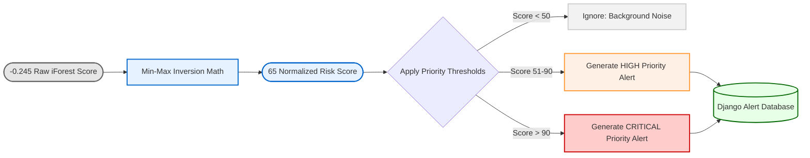

# Chapter 8: Alert Prioritization & Risk Scoring

As established in the previous chapter, the output of the `IsolationForest` algorithm is a mathematical "Depth Score", which is often represented as a negative float value (e.g., `-0.245`). Presenting a negative decimal to a banking compliance officer provides zero actionable context. 

This chapter explains the mathematical processing layer that normalizes the purely geometric ML outputs into a human-readable, `0 to 100` intuitive "Risk Score," and how that score dictates alert prioritization.

## 8.1 Normalizing Mathematical Isolation Forest Scores

Normalization is a standard mathematical technique used to shift data points from an arbitrary range into a widely understood scale (like a percentage). 

We extract the minimum and maximum outputs from the Isolation Forest's raw array. We then apply Min-Max normalization, but inversely—because in scikit-learn's Isolation Forest, the most negative numbers are the highest anomalies.

```python
# Extract the arbitrary bounds of the current inference run
min_score, max_score = scores.min(), scores.max()

if max_score == min_score:
    # Edge case: All data is identical
    normalized_scores = [50] * len(scores)
else:
    # Inverse Min-Max Scaling (0 to 100 scale)
    normalized_scores = (1 - ((scores - min_score) / (max_score - min_score))) * 100
```

**Code Explanation:**
*   **The Denominator (`max_score - min_score`)**: Establishes the total range of algebraic variance found in the transaction geometry.
*   **The Numerator (`scores - min_score`)**: Determines where each specific account sits within that variance.
*   **The Inversion (`1 - (...)`)**: Inverts the logic so that the algorithm's lowest negative values become the highest positive decimals.
*   **The Scaling (`* 100`)**: Multiplies the decimal (e.g., `0.957`) by 100 to generate an integer score (e.g., `95`).

An account with a Risk Score of `95` fundamentally means its geometry borders the absolute extreme mathematical edge of the observed data universe. 

### [Diagram: Risk Normalization and Alert Categorization]

**Diagram Explanation:**
*   **Input to Score:** The unintuitive negative float generated by the ML array is normalized into a standard `0-100` ranking.
*   **Threshold Gates:** The system actively filters out low-scoring noise dynamically limiting database insertion to true anomalies (preventing analyst fatigue).
*   **Database Write:** Only validated anomalies are tagged with a severity bracket (High/Critical) and committed to the backend SQLite database for human investigation on the dashboard.

## 8.2 Threshold Engine and Alert Database Generation

Once we have a normalized `0-100` score array mapping linearly to our `account_id` array, we apply deterministic thresholds to decide which accounts require human intervention. Accounts scoring high are pushed into the `Alert` database table.

```python
for i, (account_id, row) in enumerate(features_df.iterrows()):
    risk_score = int(normalized_scores[i])
    patterns = []
    
    # Programmatic Typology Tagging based on initial vectors
    if row['total_volume'] > 1000000: patterns.append('High Volume')
    if row['structuring_count'] >= 2: patterns.append('Structuring')
    if row['mule_score'] > 0: patterns.append('Money Mule')
    if row['round_trip_count'] > 0: patterns.append('Round Trip')
    
    # Catching unexplained ML anomalies
    if risk_score > 75 and not patterns: 
        patterns.append('Anomalous Behavior - Undefined')

    # Only generate alerts for accounts demonstrating suspicious geometry
    if risk_score > 50:
        alerts_to_create.append(Alert(
            account=account,
            risk_score=risk_score,
            type=", ".join(patterns),
            priority='Critical' if risk_score > 90 else 'High'
        ))
```

**Code Explanation:**
*   **The Alert Threshold (`> 50`)**: Only accounts in the top 50th percentile of variance are even considered for review. This immediately eliminates 50% of the dataset as noise.
*   **Priority Escalation (`Critical` vs `High`)**: 
    *   `High Priority`: Scores between 51 and 90. These require review in standard SLA (Service Level Agreement) times.
    *   `Critical Priority`: Scores above 90. These represent the absolute extreme outliers and demand immediate escalation, possibly warranting preemptive blocking of funds.

## 8.3 Programmatic Typology Tagging (Attribution)

A common criticism of Machine Learning in compliance is that it forms a "Black Box"—the AI says it's bad, but it can't explain why. Regulators require exact compliance rationale when accounts are frozen.

To solve this, as seen in the code block above, we retain the original rule-based vectors (`total_volume`, `structuring_count`, etc.) and append text strings to a `patterns` array if the specific vector was breached. 

This means when an Alert lands on an analyst's desk, it doesn't just say `Risk: 95`. It explicitly tags: *"Risk: 95. Typologies Identified: [Structuring, Money Mule]."*. 

This explicit tagging is critical, as it forms the exact "Context Key" that will be passed into the Generative AI (RAG) system in the next layer to synthesize the compliance report.
