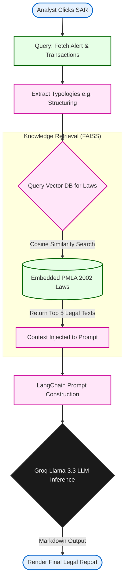

# Chapter 9: RAG-Based Legal Intelligence System

The final challenge in an enterprise AML pipeline is not just identifying the crime, but proving it. Banking regulators, such as the Financial Intelligence Unit (FIU-IND), require documented proof—a Suspicious Activity Report (SAR)—detailing exactly how a client's transactions violated specific anti-money laundering laws.

This chapter details the Generative AI microservice that autonomously drafts these legal compliance reports. We utilize a **Retrieval-Augmented Generation (RAG)** architecture powered by LangChain, a FAISS Vector Database, and the Groq LLM.

## 9.1 Automating Suspicious Activity Reports (SAR) via Generative AI

Current Large Language Models (LLMs) like GPT or LLaMA are powerful writers, but they suffer from "hallucinations"—a phenomenon where the AI confidently invents fake facts. If an AI hallucinates a non-existent section of financial law in an official government report, the bank faces massive legal penalties.

Therefore, we cannot simply ask an LLM, *"Draft a money laundering report for Account X."* We must physically restrict the LLM to only read and cite verified legal documents. This bounding technique is called RAG.

### [Diagram: The RAG Architecture Flow]

**Diagram Explanation:**
*   **Knowledge Retrieval:** Instead of relying on the LLM's internal memory, we execute a mathematical similarity search on our own local `FAISS` database containing exact text from the PMLA 2002 Acts.
*   **Context Injection:** The exact laws retrieved are appended directly to the text prompt along with the raw transaction numbers.
*   **Constrained Inference:** The LLM acts purely as a synthesizer. It reads the transactions, reads the provided laws, and perfectly formats them into a final markdown document.

## 9.2 Knowledge Base Construction (PMLA & RBI Guidelines)

Before a search can occur, the `FAISS` (Facebook AI Similarity Search) database must be populated. During system initialization, PDF documents containing the **Prevention of Money Laundering Act (2002)** and the **RBI KYC Master Directions** are parsed.

These dense legal texts are split into smaller overlapping "chunks." Each chunk is passed through an Embedding Model (e.g., `sentence-transformers`) which translates the text into a massive high-dimensional vector array. These vectors are mapped onto a multidimensional plane. 

When text exhibits semantic similarity (e.g., "Tax Evasion" and "Money Laundering"), their mathematical vectors sit very close together in this theoretical plane.

## 9.3 Embedding Pipeline and Vector Store Retrieval

When an analyst triggers a SAR generation for an account tagged with a specific typology (e.g., `Structuring`), the RAG engine initiates a similarity search.

```python
# 1. Dynamically construct the search query based on the ML output
query = f"Money laundering laws related to {', '.join(patterns)} under PMLA 2002 and RBI KYC Master Directions"

# 2. Query the FAISS Vector DB for closest mathematical matches (k=5)
if self.vector_db:
    docs = self.vector_db.similarity_search(query, k=5)
    
    # 3. Format the retrieved laws into a readable string block
    relevant_laws = "\n\n".join([f"Source: {doc.metadata.get('source')}\nContent: {doc.page_content}" for doc in docs])
```

**Code Explanation:**
*   **`similarity_search(query, k=5)`:** The text `query` is embedded into a vector. FAISS uses Cosine Similarity to scan millions of text chunks instantly and return the `k=5` chunks that are geometrically closest to the query vector. 
*   These returned `docs` are literal verbatim paragraphs extracted from the government laws, complete with metadata citing the exact page and section source.

## 9.4 Prompt Engineering for Legal Compliance

With the true legal text isolated, we use **LangChain** to construct an extremely strict prompt. We utilize System Prompts to establish a highly professional persona, restricting the LLM from engaging in creative writing.

```python
prompt = ChatPromptTemplate.from_messages([
    ("system", """You are an elite Financial Crime Compliance Officer at a major Indian Bank. 
    You are generating a formal Suspicious Activity Report (SAR) for the Financial Intelligence Unit (FIU-IND).
    
    FORMATTING RULES:
    - Use standard Markdown.
    - Be extremely concise and professional.
    - If the provided laws don't explicitly mention the pattern, infer from general Principles of PMLA (Section 3).
    - DO NOT HALLUCINATE LAWS outside of the provided RAG text.
    """),
    ("user", """
    ### INPUT DATA FOR ANALYSIS:
    **Transaction Evidence:**
    {evidence}

    **Detected Patterns:**
    {patterns}

    **RAG REGULATORY GUIDANCE (SOURCE MATERIAL):**
    {laws}
    """)
])
```

**Code Explanation:**
*   **System Prompt:** Injects rigid constraints guaranteeing output consistency. 
*   **User Payload Mapping:** The `{evidence}`, `{patterns}`, and `{laws}` variables are dynamically injected at runtime, forming a massive contextual payload. The AI reads the transactions (`evidence`), understands the crime (`patterns`), and maps it to the exact legal phrasing (`laws`).

## 9.5 LLM Inference Architecture (Groq: Llama-3.3-70b-versatile)

Finally, the constructed Prompt Chain is executed. We chose the **Groq API** running Meta's `llama-3.3-70b-versatile` open-weights language model. 

```python
# Initialize Groq LLM with extreme low temperature for logical output
self.llm = ChatGroq(
    temperature=0.1,  
    model_name="llama-3.3-70b-versatile",
    groq_api_key=api_key
)

# Execute LangChain Inference
chain = prompt | self.llm
response = chain.invoke({...payload parameters...})
```

**Architectural Choice Justification:**
*   **Temperature=0.1:** In LLMs, temperature controls "creativity." For poetry, a high temperature is good. For filing legal documents against criminals with federal authorities, we maintain an extremely low temperature (`0.1`) forcing the model to be deterministic, factual, and rigid.
*   **Groq LPU:** Groq operates on custom silicon (Language Processing Units) rather than traditional GPUs. This results in inference speeds exceeding 300+ tokens per second. A 3-page SAR report that takes an analyst 40 minutes to draft and format is completely generated mathematically by the AI in approximately 1.5 seconds.
